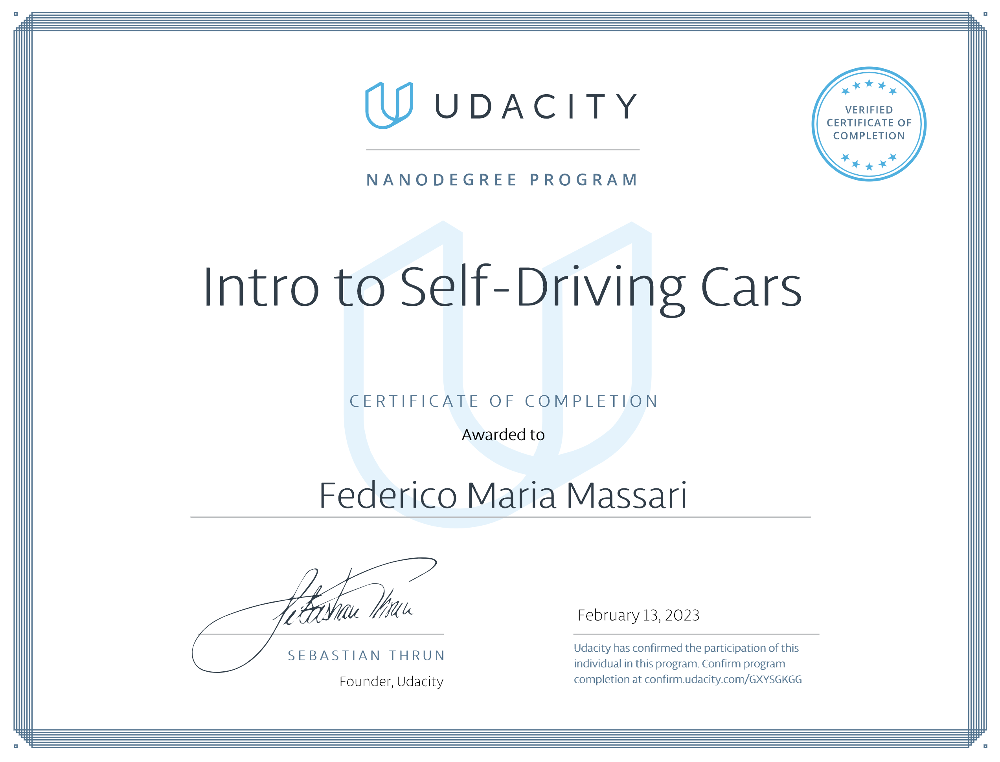

# Udacity Intro to Self-Driving Cars Nanodegree

My Udacity Intro to Self-Driving Cars Nanodegree projects, in Python and C++.

## Certification



## Project 1: Implement a Matrix Class

### Overview

_Refresh object-oriented programming and linear algebra skills by implementing a Matrix Class in pure Python._

OOP and linear algebra are essential skills for self-driving cars. This projects 

__[Link to code](/projects/p1)__

### Output of `tests/test.py`

```
============================= test session starts ==============================
collecting ... collected 14 items

test.py::test_matrix_addition PASSED                                     [  7%]
test.py::test_matrix_subtraction PASSED                                  [ 14%]
test.py::test_matrix_negative PASSED                                     [ 21%]
test.py::test_matrix_transpose PASSED                                    [ 28%]
test.py::test_trace_on_non_square_matrix_raises_value_error PASSED       [ 35%]
test.py::test_trace PASSED                                               [ 42%]
test.py::test_determinant_on_non_square_matrix_raises_value_error PASSED [ 50%]
test.py::test_determinant_on_matrices_larger_than_3x3_raises_not_implemented_error PASSED [ 57%]
test.py::test_determinant_1x1 PASSED                                     [ 64%]
test.py::test_determinant_2x2 PASSED                                     [ 71%]
test.py::test_determinant_3x3 PASSED                                     [ 78%]
test.py::test_matrix_inverse_on_singular_matrix_raises_value_error PASSED [ 85%]
test.py::test_matrix_inverse_2x2 PASSED                                  [ 92%]
test.py::test_matrix_inverse_3x3 PASSED                                  [100%]

============================== 14 passed in 0.01s ==============================

Process finished with exit code 0
```

## Project 1.B: Implement a Matrix Class in C++

### Overview

To prepare for the upcoming projects, I converted the Python matrix class from Project 1 to C++ and provided basic unit testing. Operator overloading is used for most operations, to enhance readability.

__[Link to code](/projects/p1b)__

### How to Compile and Run the Project

We suppose the project resides at address `/home/$whoami/workspace/udacity-isdcnd/projects/p1b`, with `$whoami` the username of the current user (verify on console). Compile both `tests.cpp` and `matrix.cpp` as follows:

```bash
cd /home/$whoami/workspace/udacity-isdcnd/projects/p1b
g++ -std=c++11 tests.cpp matrix.cpp
./a.out
```

### Output of `tests.cpp`

```
All tests passed.
```

## Project 2: Translate Python to C++

### Overview

__[Link to code](/projects/p2)__

### How to Compile and Run the Project

Compile and run the project as follows:

```bash
cd /home/$whoami/workspace/udacity-isdcnd/projects/p2
g++ -std=c++11 tests.cpp
./a.out
```

### Output of `tests.cpp`

```
! - normalize function worked correctly!

! - blur function worked correctly!

! - initialize_beliefs function worked correctly!

! - move function worked correctly with zero blurring

! - sense function worked correctly
```

## Project 3 (Optional): Optimize Histogram Filter

### Overview

__[Link to code](/projects/p3)__

### How to Compile and Run the Project

We suppose a folder structure similar to that in which Projects 1.B and 2 reside. Move to folder `/home/$whoami/workspace/udacity-isdcnd/projects/p3/optimized`. Compile and run as follows:

```bash
cd /home/$whoami/workspace/udacity-isdcnd/projects/p3/optimized
g++ -std=c++11 main.cpp blur.cpp initialize_beliefs.cpp move.cpp normalize.cpp print.cpp sense.cpp zeros.cpp
./a.out
```

### Unoptimized Starting Code

Unoptimized starting code from Udacity is also included for comparison purposes (in the "unoptimized" folder). It is hosted here because, to the best of my knowledge, no official repository for the code is available online. The code is compiled and run the same way the optimized code is.

### Output

Running on Macbook Pro M1 Max prints out the following output (slightly varying among trials):

| Metric | Unoptimized | Optimized | Relative Improvement |
|----------|------:|------:|------:|
| Number of iterations | 10000 | 10000 | - |
| Duration milliseconds `initialize_beliefs.cpp` | 58.514 | 23.583 | 60% |
| Duration milliseconds `sense.cpp` | 48.234 | 14.519 | 70% |
| Duration milliseconds `blur.cpp` | 83.812 | 29.275 | 65% |
| Duration milliseconds `normalize.cpp` | 46.425 | 13.760 | 70% |
| Duration milliseconds `move.cpp` | 39.099 | 11.598 | 70% |
