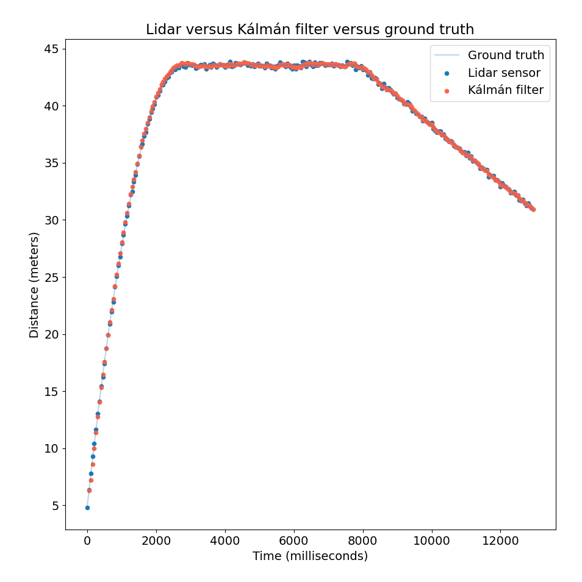

# Udacity Intro to Self-Driving Cars Nanodegree

My Udacity Intro to Self-Driving Cars Nanodegree projects, in Python and C++.

## Certification


## Project 1: Implement a Matrix Class

### Overview

_Refresh object-oriented programming and linear algebra skills by designing a Matrix Class in pure Python._

OOP and linear algebra are building blocks of autonomous systems like self-driving cars. This projects implements core operations of a matrix class such as addition, subtraction, negation, multiplication (by matrix and scalar), transpose and inverse.

The matrix class can then be used to run Kálmán filters for object tracking, smoothing out lidar and radar data to make more accurate predictions.

__[Link to code](/projects/p1)__

<table>
  <tr>
    <td align="center"></td>
    <td align="center"></td>
  </tr>
</table>

### Output of `tests/test.py`

`test.py` is a pytest unit testing suite that can be run in PyCharm or via command line. All tests pass.

## Project 1.B: Implement a Matrix Class in C++

### Overview

To prepare for the upcoming project, I converted the Python matrix class to C++ and added unit testing. Operator overloading is used for most operations for better readability and comparison with the Python implementation, which uses magic methods like `__add__` or `__rmul__` to achieve the same result.

__[Link to code](/projects/p1b)__

### How to Compile and Run the Project

We suppose the project resides at address `/home/$whoami/workspace/udacity-isdcnd/projects/p1b`, with `$whoami` the username of the current user (verify on console). Compile both `tests.cpp` and `matrix.cpp`:

```bash
cd /home/$whoami/workspace/udacity-isdcnd/projects/p1b
g++ -std=c++11 tests.cpp matrix.cpp
./a.out
```

### Output of `tests.cpp`

```
All tests passed.
```

## Project 2: Translate Python to C++

_Translate an existing Python implementation of the robot localization problem to C++._


### Overview

__[Link to code](/projects/p2)__

### How to Compile and Run the Project

Compile and run the project as follows:

```bash
cd /home/$whoami/workspace/udacity-isdcnd/projects/p2
g++ -std=c++11 tests.cpp
./a.out
```

### Output of `tests.cpp`

```
! - normalize function worked correctly!

! - blur function worked correctly!

! - initialize_beliefs function worked correctly!

! - move function worked correctly with zero blurring

! - sense function worked correctly
```

## Project 3 (Optional): Optimize Histogram Filter

### Overview

_Optimize functioning (but inefficient) code using low-level language features that make C++ fast._

Starting from an existing C++ implementation of the histogram filter from Project 2, I applied basic optimization techniques such as reserving space for vectors, passing by reference, and avoiding extra variables or control flow statements to enhance code speed and decrease memory consumption.

__[Link to code](/projects/p3)__

### How to Compile and Run the Project

We suppose a folder structure similar to that in which Projects 1.B and 2 reside. Move to folder `/home/$whoami/workspace/udacity-isdcnd/projects/p3/optimized`. Compile and run as follows:

```bash
cd /home/$whoami/workspace/udacity-isdcnd/projects/p3/optimized
g++ -std=c++11 main.cpp blur.cpp initialize_beliefs.cpp move.cpp normalize.cpp print.cpp sense.cpp zeros.cpp
./a.out
```

### Unoptimized Starting Code

Unoptimized starting code from Udacity is also included for comparison purposes (in the "unoptimized" folder). It is hosted here because, to the best of my knowledge, no official repository for the code is available online. The code is compiled and run the same way the optimized code is.

### Output

Running on Macbook Pro M1 Max prints out the following output (slightly varying among trials):

| Metric | Unoptimized | Optimized | Relative Improvement |
|----------|------:|------:|------:|
| Number of iterations | 10000 | 10000 | - |
| Duration milliseconds `initialize_beliefs.cpp` | 58.514 | 23.583 | 60% |
| Duration milliseconds `sense.cpp` | 48.234 | 14.519 | 70% |
| Duration milliseconds `blur.cpp` | 83.812 | 29.275 | 65% |
| Duration milliseconds `normalize.cpp` | 46.425 | 13.760 | 70% |
| Duration milliseconds `move.cpp` | 39.099 | 11.598 | 70% |
| __Total running time__ | __276.084__ | __92.735__ | __66%__ |
